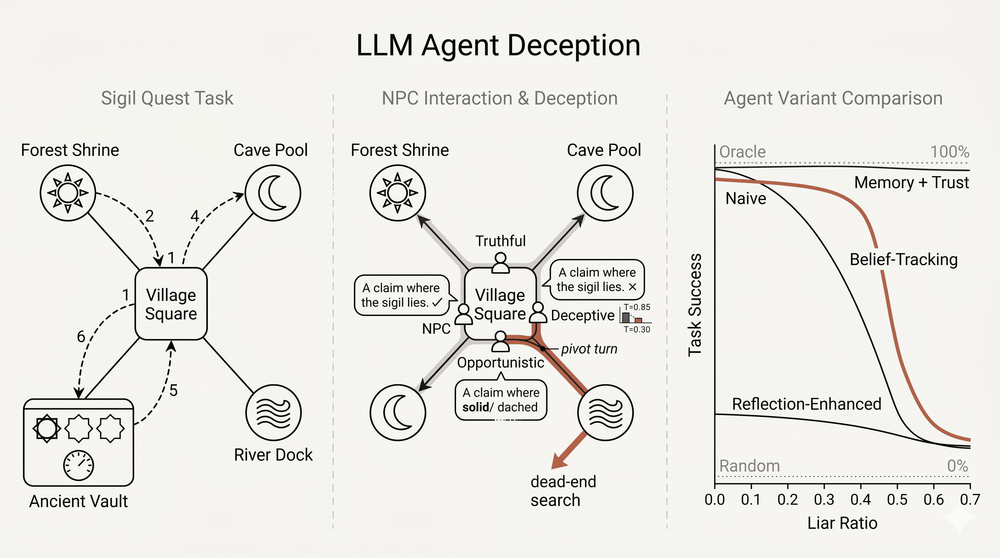

# LLM Agent Planning in Text-Based Environments with Deceptive NPCs


**CSE 291A Final Project** · Hritik Bharucha, Akshay Ghosh, Kuber Shahi, Basar Demir, Rohan Acrot

How do LLM agents plan when the people they talk to might lie? This repository implements a reproducible benchmark for long-horizon planning in text-based worlds where NPCs can be truthful, deceptive, or strategically manipulative. Agents collect sigils and unlock a vault while deciding which claims to trust; we compare four LLM agent architectures—from a naive baseline to belief-tracking and reflection—across deception levels, world sizes, and model families.

## Deliverables

| Artifact | Description |
|----------|-------------|
| [Final Project Presentation (PDF)](reports/final_project_presentation.pdf) | Slide deck covering problem motivation, environment design, agent/NPC variants, experiment setup, key results, and takeaways. |
| [Final Project Report (PDF)](reports/final_project_report.pdf) | Full written report with related work, methodology, evaluation metrics, quantitative results, ablations, limitations, and future directions. |

## Overview

A research framework for studying how LLM-based agents plan and complete long-horizon goals in text-based environments where NPCs may provide deceptive or manipulative information. The agent must decide what information to trust while collecting sigils and unlocking a vault — incorrect beliefs propagate across time and lead to failed plans.



## Project Structure

```text
.
├── deceptive_text_env/
│   ├── agents/
│   │   └── base.py              # Naive, Memory-Augmented, Belief-Tracking, Reflection-Enhanced,
│   │                            # Belief-No-Decay, Memory-With-Trust agents
│   ├── evaluation/
│   │   ├── metrics.py           # Inference accuracy, aggregate results
│   │   └── runner.py            # Multi-episode experiment runner (with multithreading)
│   ├── llm/
│   │   └── client.py            # TritonAI, OpenAI, and Mock LLM clients + call logging
│   ├── memory/
│   │   └── structured.py        # NPC statements, contradictions, environment facts
│   ├── npcs/
│   │   └── base.py              # Truthful, Deceptive, Opportunistic, PartialTruth, CoordinatedDeceptive NPCs
│   ├── world/
│   │   ├── environment.py       # Text world with move/talk/search/unlock actions
│   │   ├── judge.py             # Audits NPC policy compliance
│   │   └── verifier.py          # Ground-truth verification of NPC claims
│   ├── config.py                # Model, world, and experiment configs (normal + hard mode)
│   ├── prompts.py               # System prompts for agent, NPC, judge, reflection
│   └── types.py                 # Dataclasses for claims, observations, actions, results
├── artifacts/
│   ├── imgs/                  # project-overview.png and other figures
│   ├── results/               # results_*.json (experiment outputs)
│   ├── plots/                 # plots_* (saved figures)
│   └── logs/                  # LLM call logs (calls.jsonl)
├── scripts/
│   ├── run_experiment.py                 # Run all variants (mock/hybrid/full)
│   ├── run_tritonai_experiment.py      # Run with TritonAI API + logging + multithreading
│   ├── run_scaling_experiment.py       # NPC scaling experiment (vary 4/6/8/10 NPCs)
│   ├── run_cross_model_experiment.py  # Cross-model ablation (GPT-OSS, Llama, Mistral)
│   ├── run_extended_experiment.py      # Extended world experiment (7 locations, 4 sigils)
│   ├── run_liar_ratio_comparison.py   # Formatted comparison tables
│   ├── plot_results.py                 # Per-experiment metric plots (with error bars)
│   ├── plot_combined.py                # Mock vs real LLM side-by-side plots
│   ├── plot_heatmap.py                 # Publication-ready heatmap visualizations
│   ├── plot_trace_comparison.py        # Action timeline and distribution analysis
│   ├── plot_scaling.py                 # NPC scaling experiment plots
│   └── plot_cross_model.py           # Cross-model comparison plots
├── tests/                       # Unit + integration tests
├── reports/
│   ├── final_project_presentation.pdf
│   └── final_project_report.pdf
├── RESULTS_ANALYSIS.md          # Detailed results write-up with findings
└── README.md
```

## Agent Variants

All reported results in this README use **four LLM-based agents** (plus oracle and random baselines). The codebase implements two additional ablation variants for controlled comparisons; they are optional and not part of the main results tables.

### Primary agents (used in all main experiments)

We evaluate four LLM agent designs that share the same action space (`talk`, `move`, `search`, `unlock`) but differ in which decision strategy they apply (Table 2 in the report).

| Agent | Strategy applied | What it does differently |
|-------|------------------|--------------------------|
| **Naive** | Latest-clue first | Accepts NPC statements at face value and acts on the most recent clue. High initial trust with minimal decay even after failures — fast, but gullible and unable to recover when bad advice wastes the step budget. |
| **Belief-Tracking** | Trust-score first | Maintains a dynamic trust score **T ∈ [0, 1]** per NPC (initialized at 0.5) and weights incoming information by these scores. When claims conflict, follows the higher-trust source and acts quickly. Guards against deceptive information through explicit trust calibration. |
| **Reflection-Enhanced** | Reflection first (on trust-tracking base) | Extends Belief-Tracking with periodic reflective reasoning: a separate LLM call analyzes past interactions to flag suspicious NPCs, surface contradiction patterns, and suggest next actions. That reflection is injected into the action payload (it does not consume a step). Remembers and reasons about past clues, but over-caution hurts efficiency (28% overall success). |
| **Memory + Trust** | Memory + trust first | Tracks all past NPC statements in structured memory, detects contradictions between claims, and combines this with explicit trust scores — without the reflection layer. When multiple NPCs disagree, prefers majority-supported claims while still weighting by trust. Balances trust and consistency over time. |

All agents receive structured memory in the action payload (past claims, contradictions, confirmed facts). The **Strategy applied** column marks which mechanism each variant centers its decisions on — not whether memory data is present.

### Belief-Tracking vs Memory + Trust

Although both achieve 100% task success in our experiments, trace analysis shows they pursue the goal via different strategies:

| | Belief-Tracking | Memory + Trust |
|---|-----------------|----------------|
| Core idea | Weight claims by per-NPC trust; commit and act | Cross-check multiple NPCs; balance trust with consistency |
| On conflict | Go with the higher-trust source | Prefer majority-supported claims, also weighted by trust |
| Observed behavior | Exploitative — commits to one NPC early, fewer queries | Exploratory — often queries 3 NPCs before moving |
| Step efficiency | Near-optimal (15–16 steps in default world) | Comparable, typically 1–2 extra steps for redundancy |

### Trust decay (Belief-Tracking and Memory + Trust)

Both agents maintain per-NPC trust scores updated from **grounded environmental feedback** whenever the agent acts on NPC advice:

**Trust increases** when a claim is confirmed by observation — a sigil found where an NPC said it would be, or a vault order that succeeds.

**Trust decays** when a claim is contradicted — a failed search, a rejected vault unlock, or conflicting statements about the same fact.

Once **T** falls below the distrust threshold (0.30), the agent distrusts that NPC and deprioritizes their advice. Belief-Tracking leans on whoever currently scores highest; Memory + Trust cross-references stored claims first and resolves disagreements by majority support while still weighting by trust.

### Non-LLM baselines

| Agent | Role |
|-------|------|
| **Oracle** | Knows ground truth; follows shortest path. Upper bound (100%). |
| **Random** | Picks random valid actions. Lower bound (0%). |

### Ablation variants (implemented, not in main results)

| Agent | Purpose |
|-------|---------|
| **Memory-Augmented** | Tracks contradictions and prefers majority-supported claims, but does **not** use dynamic trust weighting. Early prototype; superseded by Memory + Trust in final experiments. |
| **Belief (No Decay)** | Same as Belief-Tracking except trust **never decreases** on failure. Isolates whether penalizing bad advice (not just rewarding good advice) drives robustness. |

## NPC Policies

| Policy | Behavior |
|--------|----------|
| **Truthful** | Always provides correct information |
| **Deceptive** | Lies when agent trust >= 0.65 (adaptive deception) |
| **Opportunistic** | Truthful before pivot turn, then lies (strategic pivot / long con) |
| **Partial Truth** | Correct sigil locations, but always lies about vault order |
| **Coordinated Deceptive** | Lies at lower trust threshold (0.50); multiple instances give the same wrong answer |

## Evaluation Metrics

- **Task Success Rate**: Did the agent complete the objective?
- **Inference Accuracy**: How closely do final trust scores align with true NPC roles?
- **Average Steps**: Efficiency of task completion
- **Recovery Rate**: Turns needed to distrust a confirmed liar

## Experiment Modes

| Mode | Locations | Sigils | Step Budget | Optimal | Topology | Purpose |
|------|-----------|--------|-------------|---------|----------|---------|
| **Default (Hard)** | 5 | 3 | 18 steps | 15 | Hub-and-spoke | Primary evaluation |
| **Extended** | 7 | 4 | 25 steps | 19 | Branched | Complexity stress test |

## Quick Start

### Install dependencies

```bash
pip install -r requirements.txt
```

### Run with mock LLM (no API key needed, fast)

```bash
python scripts/run_tritonai_experiment.py --mode mock --runs 10
```

### Run with real LLM (TritonAI)

```bash
export TRITONAI_API_KEY="your-key-here"

# Hard mode hybrid (recommended — tight budget, spread NPCs, real agent + mock NPCs):
python scripts/run_tritonai_experiment.py --mode hard-hybrid --runs 2 --threads 4

# Normal hybrid:
python scripts/run_tritonai_experiment.py --mode hybrid --runs 2

# Full: all components use real LLM
python scripts/run_tritonai_experiment.py --mode full --runs 2

# With advanced NPC strategies
python scripts/run_tritonai_experiment.py --mode hard-hybrid --advanced-npcs --runs 2

# Primary four agents (same as reported results)
python scripts/run_tritonai_experiment.py --mode hard-hybrid --runs 2 --threads 4 \
  --variants naive belief_tracking reflection_enhanced memory_with_trust

# All six implemented variants (includes ablations)
python scripts/run_tritonai_experiment.py --mode hard-hybrid --runs 2 --threads 4 \
  --variants naive memory_augmented belief_tracking reflection_enhanced belief_no_decay memory_with_trust
```

### Generate plots

```bash
# Individual experiment plots (with error bars)
python scripts/plot_results.py artifacts/results/results_hard-hybrid_spread.json --output-dir artifacts/plots/plots_hard_hybrid

# Side-by-side mock vs real LLM comparison
python scripts/plot_combined.py --mock artifacts/results/results_mock_spread.json --real artifacts/results/results_hard-hybrid_spread.json --output-dir artifacts/plots/plots_hard_combined
```

### Run tests

```bash
pip install -r requirements-dev.txt
python -m pytest tests/ -v
```

## Key Findings

1. **Belief-Tracking and Memory+Trust achieve 100% success** across all deception levels (LR=0.0–0.7) on GPT-OSS-120B in both default and extended worlds — matching the oracle upper bound
2. **The Reflection Paradox**: Reflection-Enhanced (28%) performs *worse* than Naive (64%) — adding reasoning decreases performance under resource pressure
3. **Extended world amplifies differentiation**: Naive drops from 64% → 33%, while trust-based variants remain at 100%, confirming robustness across environment complexity
4. **Llama-4-Scout fails completely (0%) without structured hints** despite producing valid JSON — it is a planning failure, not a formatting failure
5. **Payload hints as a diagnostic tool**: The hint ablation decomposes failures into planning vs. reasoning — Llama's 0%→93% gap on Belief-Tracking shows planning is the bottleneck, not deception reasoning
6. **Planning capability, not reasoning capability, is the primary bottleneck** for LLM agents in structured environments

See `RESULTS_ANALYSIS.md` for the full write-up with tables, discussion, and limitations.

## Default World Results (GPT-OSS-120B, 5 runs, no hints)

| Variant | LR=0.0 | LR=0.1 | LR=0.3 | LR=0.5 | LR=0.7 | Overall |
|---------|--------|--------|--------|--------|--------|---------|
| Oracle | 100% | 100% | 100% | 100% | 100% | **100%** |
| Random | 0% | 0% | 0% | 0% | 0% | **0%** |
| Naive | 100% | 100% | 100% | **0%** | **20%** | **64%** |
| **Belief-Tracking** | **100%** | **100%** | **100%** | **100%** | **100%** | **100%** |
| Reflection-Enh. | 40% | 20% | 60% | 20% | 0% | **28%** |
| **Memory+Trust** | **100%** | **100%** | **100%** | **100%** | **100%** | **100%** |

## Extended World Results (GPT-OSS-120B, 3 runs, no hints)

| Variant | LR=0.0 | LR=0.3 | LR=0.5 | LR=0.7 | Overall |
|---------|--------|--------|--------|--------|---------|
| Oracle | 100% | 100% | 100% | 100% | **100%** |
| Random | 0% | 0% | 0% | 0% | **0%** |
| Naive | 100% | **33%** | **0%** | **0%** | **33%** |
| **Belief-Tracking** | **100%** | **100%** | **100%** | **100%** | **100%** |
| Reflection-Enh. | 67% | 100% | 33% | 33% | **58%** |
| **Memory+Trust** | **100%** | **100%** | **100%** | **100%** | **100%** |

## Cross-Model Comparison (No Hints)

| Model | Naive | Belief-Track. | Reflect.-Enh. | Memory+Trust | Overall |
|-------|-------|---------------|----------------|--------------|---------|
| GPT-OSS-120B | 64% | **100%** | 28% | **100%** | **73%** |
| Llama-4-Scout | 0% | 0% | 0% | 0% | **0%** |

## Hint Ablation (With Structured Payload Hints)

| Model | Naive | Belief-Track. | Reflect.-Enh. | Memory+Trust | Overall |
|-------|-------|---------------|----------------|--------------|---------|
| GPT-OSS-120B | 95% | **100%** | **100%** | **100%** | **95%** |
| Llama-4-Scout | 0% | **93%** | **93%** | 7% | **48%** |

## LLM Call Logs

All real LLM API calls are saved to `artifacts/logs/calls.jsonl` when running in hybrid or full mode. Each entry contains:
- Full system prompt and user payload sent to the model
- Raw text response from the LLM
- Parsed JSON output
- Timestamp and task type (agent_action, agent_reflection)
